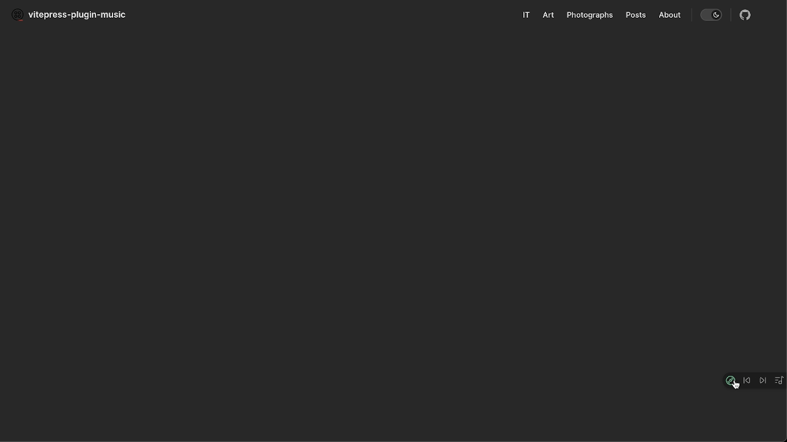

# vitepress-plugin-music

> music player plugin for vitepress

<p align="center">
  </a>
  <a href="https://www.npmjs.com/package/vitepress-plugin-music"></a>
  <a href="https://github.com/vuejs/vitepress-plugin-music/blob/master/LICENSE"></a>
</p>

## Demo


## Install
```sh
yarn add -D vitepress-plugin-music
# OR npm install -D vitepress-plugin-music
```

## Usage
```ts
// .vitepress/theme/index.ts

import DefaultTheme from "vitepress/theme"
import vitepressMusic from 'vitepress-plugin-music'
import 'vitepress-plugin-music/lib/css/index.css'

const playlist = [
  {
    name: 'song1',
    author: 'author1',
    file: '/mp3/***.mp3',
  },
  {
    name: 'song2',
    author: 'author2',
    file: 'https://***.***.***/song2.mp3',
    hide: true
  },
]

export default {
  ...DefaultTheme,
  enhanceApp: (ctx) => {
    vitepressMusic(playlist)
  }
}
```

Then you can use `vitepress-plugin-music` ! 🎉

## Change Log

> `v0.0.9`
- Automatically jumps when resource loading fails.
- The volume fades in and out.
- Tap a song that's playing in the list to pause it.
- Add hide attribute to playlist.
- Playlist style updated.

